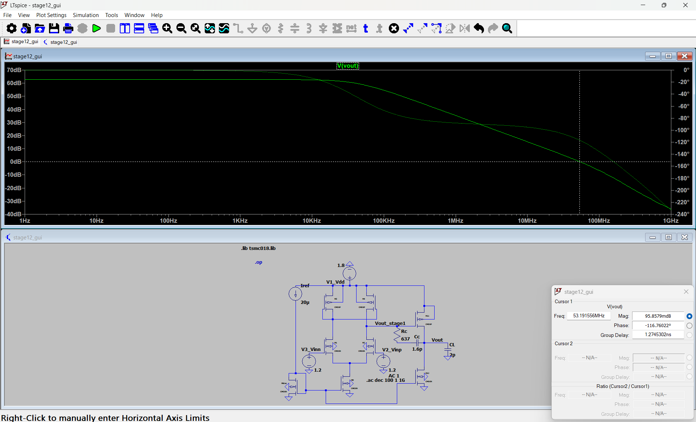
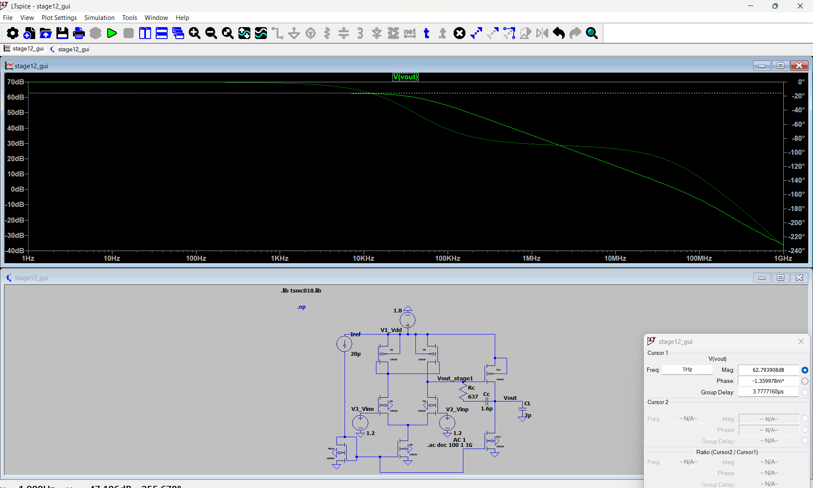
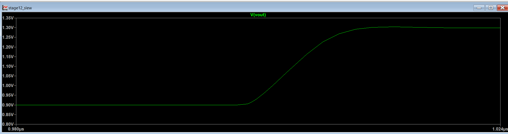
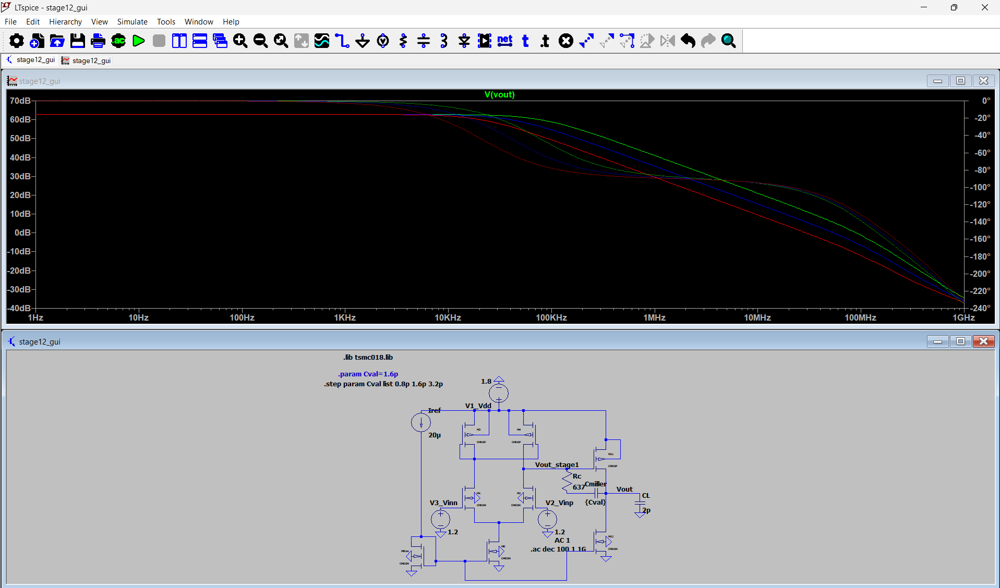

# Two-Stage CMOS Op-Amp: Analysis & Simulation (LTspice)

Simulation and analysis of a two-stage Miller-compensated CMOS op-amp (180 nm, 1.8 V, 2 pF load) in LTspice.

**Base schematic:** [ORIGINAL REPO LINK]. All measurements, the slew-rate test and the Cc sweep are my own work.

## Circuit
- Stage 1: NMOS differential pair with PMOS current-mirror load
- Stage 2: PMOS common-source stage
- Bias: 20 uA reference with NMOS current mirror
- Compensation: Miller capacitor Cc = 1.6 pF with nulling resistor Rc = 637 ohm

## Results (Cc = 1.6 pF)

| Parameter | Result |
|---|---|
| DC gain | 62.8 dB |
| Gain-bandwidth product | 53 MHz |
| Phase margin | 63 deg |
| Slew rate | 52 V/us |
| Power (1.8 V supply) | 465 uW |

## Cc sweep

| Cc | GBW | Phase margin |
|---|---|---|
| 0.8 pF | 88.8 MHz | 45 deg |
| 1.6 pF | 53 MHz | 63 deg |
| 3.2 pF | 30.3 MHz | 76 deg |

Increasing Cc lowers the GBW but improves phase margin, which is the speed vs. stability trade-off.

## How I measured
- **AC analysis:** `.ac dec 100 1 1G` with 1 V AC on Vinp. DC gain read at 1 Hz, GBW at the 0 dB crossing, phase margin = 180 deg + phase at that frequency.
- **Slew rate:** op-amp wired as a unity-gain buffer (Vout to the inverting input), input pulse 0.9 V to 1.3 V, slope measured with cursors on the rising edge. Hand estimate I_tail / Cc was about 56 V/us.
- **Power:** supply current from `.op` multiplied by 1.8 V.
- **Cc sweep:** `.step param Cval list 0.8p 1.6p 3.2p`.

## Plots

## Not covered
PVT corners, Monte Carlo, noise analysis, ICMR and output swing.
